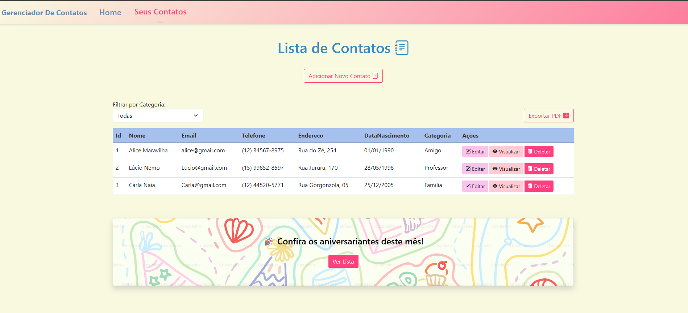
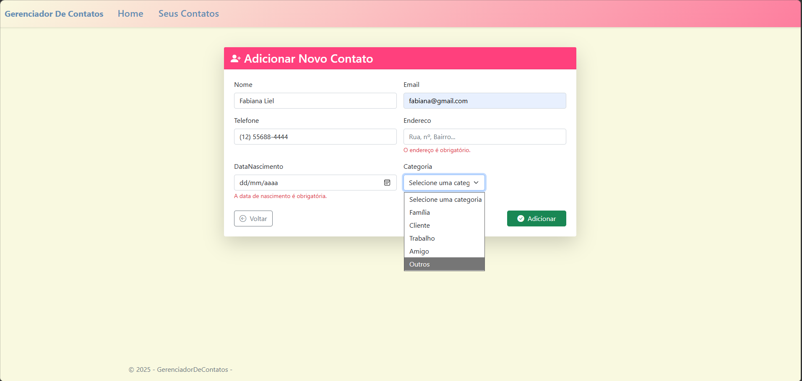
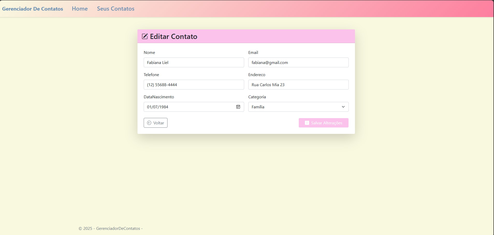
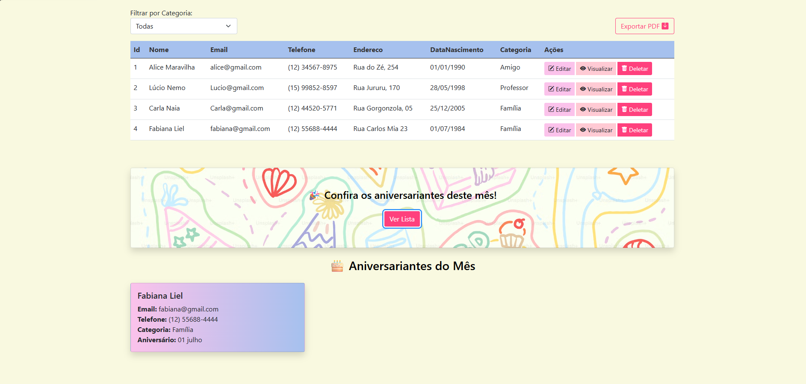
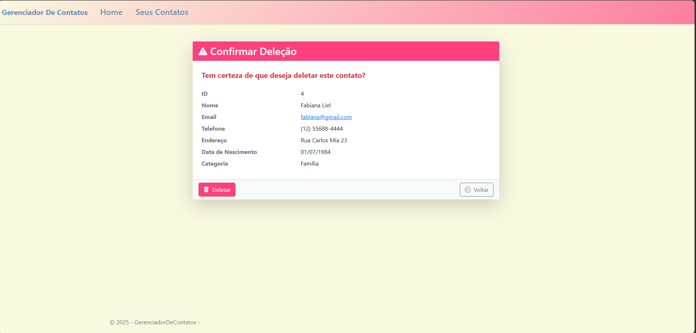

# ☎️  Gerenciador de Contatos (desenvolvido no curso técnico em Desenvolvimento de sistemas)

Aplicação web desenvolvida como atividade acadêmica com o objetivo de praticar o padrão MVC (Model-View-Controller) utilizando ASP.NET Core MVC.

O sistema permite gerenciar uma lista de contatos, realizando operações de cadastro, edição, visualização e remoção de registros, além de oferecer recursos de filtragem por categoria e exportação da lista em PDF.

## Tecnologias utilizadas

- ASP.NET Core MVC
- C#
- Razor Pages / Views
- HTML, CSS e Bootstrap
- biblioteca para geração de PDF 

## Funcionalidades

- Cadastro de contatos;
- Edição de informações;
- Visualização de detalhes;
- Exclusão de contatos;
- Listagem em tabela;
- Filtro por categoria (Amigo, Família, Professor, etc.);
- Exportação da lista para PDF;
- Aniversariantes do mês
- Validação de campos
  
## Imagens do sistema

